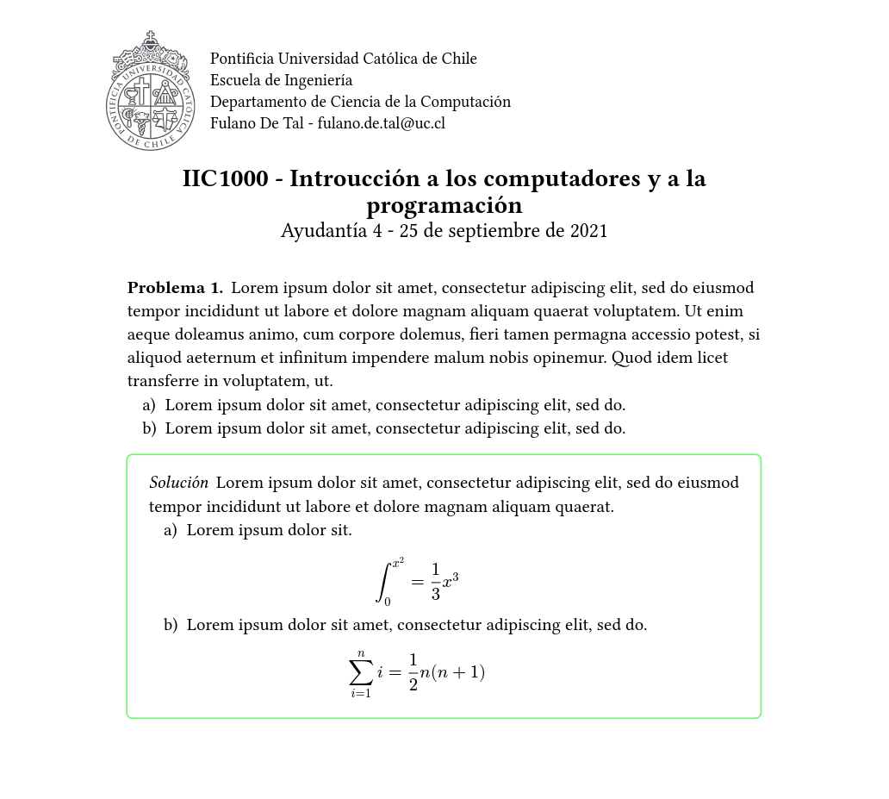

# Template para ayudantías PUC

Este repositorio contiene un template para ayudantías de la PUC en [Typst](https://typst.app/).

## ¿Cómo usarlo?

El modulo de template está en la carpeta `modules`. Copia dicha carpeta en tu proyecto y crea tu archivo typst más o menos así:

```yaml
#import "modules/template.typ": *
#show: doc => project(
    curso: (
        sigla: "IIC2213",
        nombre: "Lógica para ciencia de la computación",
        departamento: "Departamento de Ciencia de la Computación",
    ),
    autor: (
        nombre: "Fulano",
        apellido: "De Tal",
        email: "fulano.de.tal@uc.cl",
    ),
    numero_de_ayudantia: 4,
    fecha: "25 de septiembre de 2021",
    body: doc
)

#problem[
    #lorem(50)
    + #lorem(10)
    + #lorem(10)

    #solution[
        #lorem(20)
        + #[
            #lorem(4)
            $ integral_0^x^2 = 1/3 x^3 $
        ]
        + #[
            #lorem(10)
            $ sum_(i=1)^n i = 1/2 n (n+1) $
        ]
    ]
]
```


